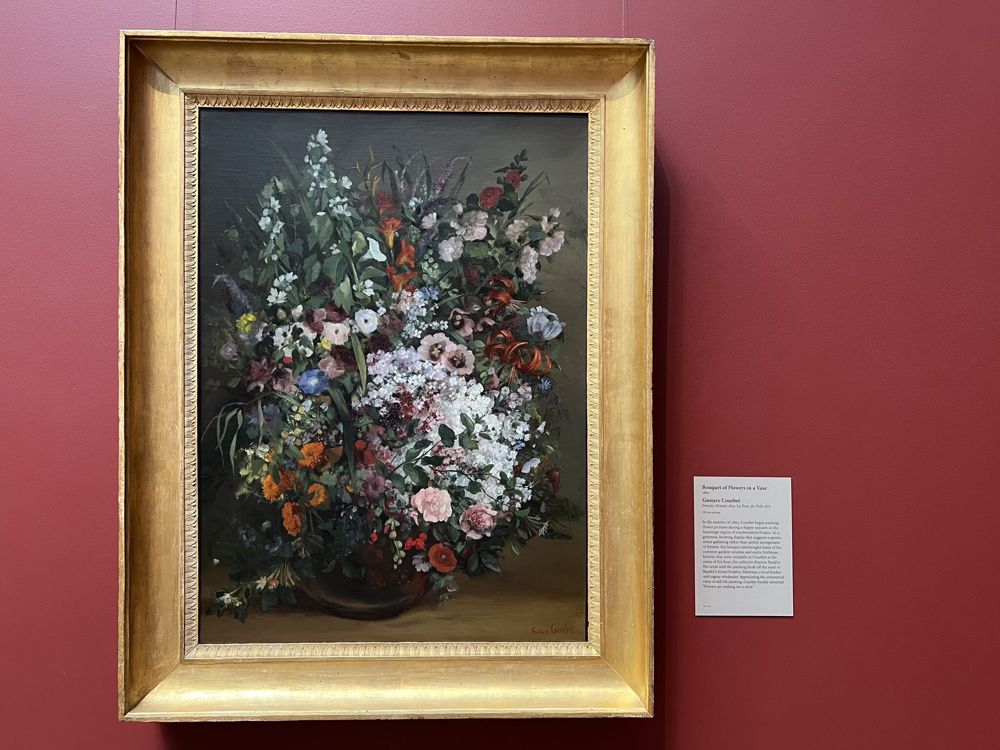
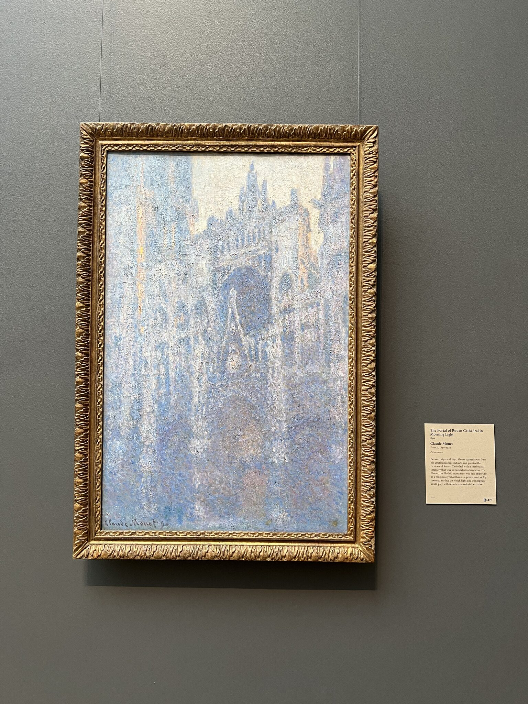
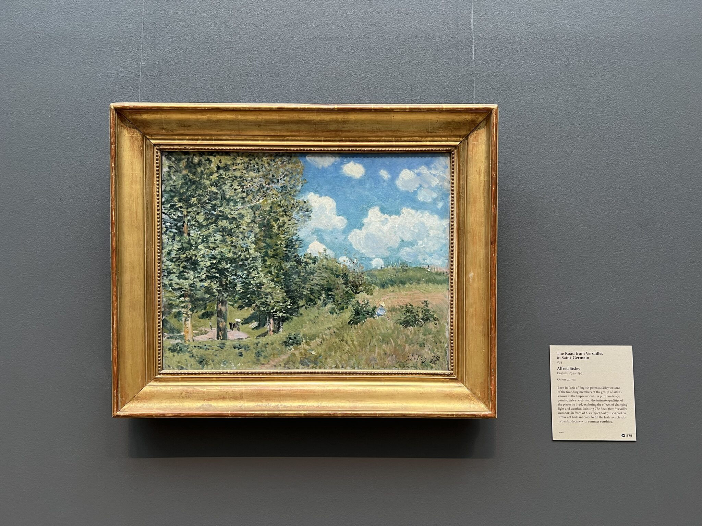
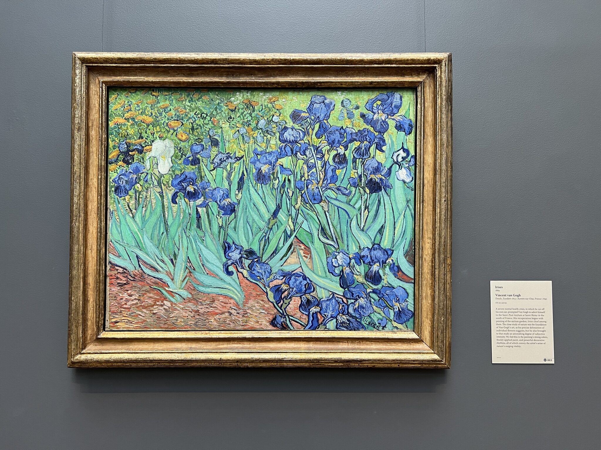
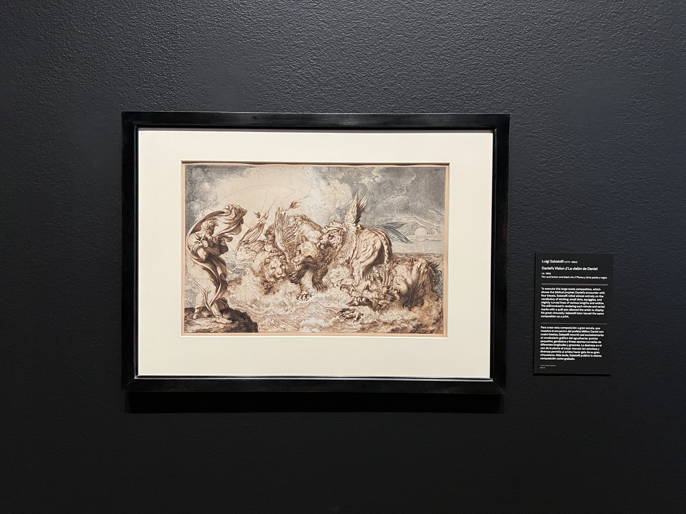
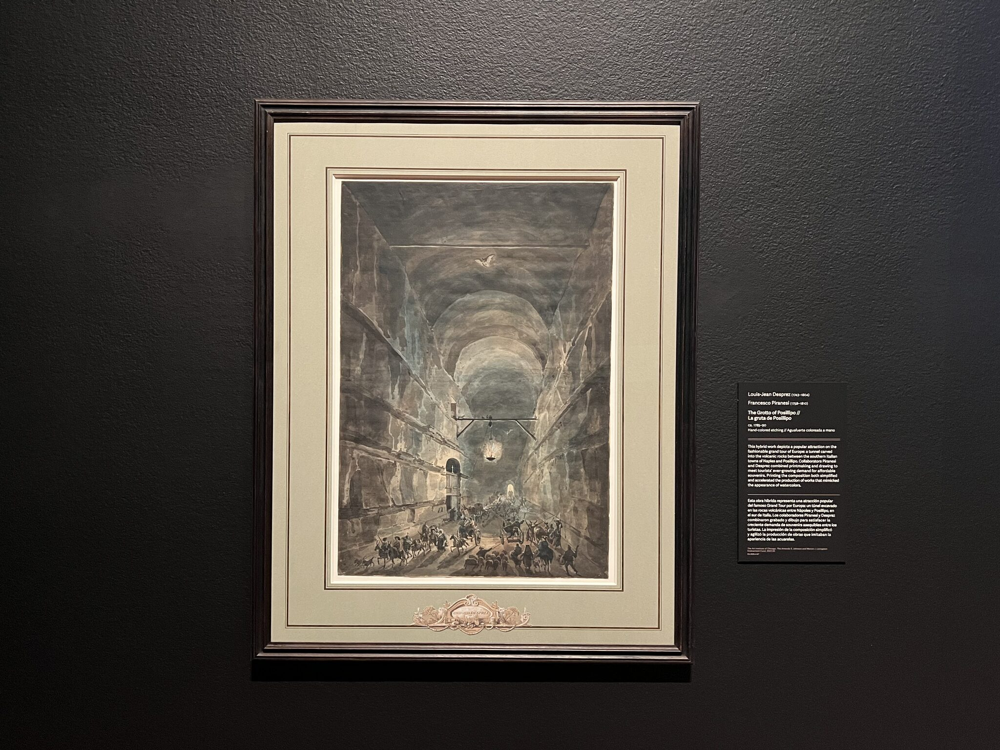

+++
title = '洛杉矶 - 2025-06-30至2025-07-03'
date = '2026-01-03'
draft = false
+++

### 写于2026-01-03

### Santa Cruz Island - 灰石豪苑 - Santa Monica Beach - 格里菲斯天文台 - 盖蒂中心 - 环球影城

在26年年初我终于有空写写去年暑假出去玩的经历了。这次是家人过来旅游。因为国内来的航班落地在洛杉矶，所以我就做了几天当地的游玩计划。

考虑到航线的开放时间，我定的第一站是去Channel Islands的最大岛屿Santa Cruz Island。

出于时间限制，我选的徒步路线是去Potato Harbor，慢慢走两个半小时内能走完。Santa Cruz Island看起来就像是海上陡然突起的一块巨石，整条路线相当于是在离悬崖有段距离的山顶上。

可能因为是阴天，海水并没有很透彻湛蓝的感觉，但是岛上风很大。山顶没有遮挡，狂风刮过连片的草地，会给人一种辽阔的自在感。

虽然徒步时间不是很久，但加上坐船和开车的时间，回到LA的时候已经是下午了。回程的时候特地去尝试了一家叫Sun Nong Dan的韩国餐厅。点的牛骨汤感觉都比较普通，但加芝士的铁板牛肉还挺好吃的，量也很大，我也靠它吃了不少次剩饭。

第二天的行程安排整体比较休闲。

我是先开车路过了一下星光大道，然后在比弗利山上随意开了很久，最后停到了灰石豪苑。我们到达的时候庄园还没到开放时间，园丁都还在打理树木，所以没什么游客。

整个花园的布景非常丰富。绿树、水池和建筑十分相得益彰，切换场景拍照也不会显得单调。因为地势较高，阳光也很好，在花园的前庭部分还可以纵览整个城市。

在庄园里闲逛拍完照，我就开去了下一个地点，Santa Monica Beach。

比起佛罗里达的沙滩，Santa Monica Beach不是太有度假的气息。在沙滩的码头边还有一个小型的游乐场，逛街的游客熙熙攘攘，感觉还挺热闹。

这一天的最后一站是格里菲斯天文台。

下午的时间在天文台的影院看了两场宇宙星系的科普电影。影院的投屏跟自然历史博物馆一样，也是半球式的穹顶。环绕式影院的观影沉浸感会比较强，这种星际穿梭的感觉果然还是百试不厌。

次日就来到了我的旅游保留项目，逛博物馆。这一天去的是盖蒂中心。

盖蒂中心的门票是不花钱的，但是它的停车场要收费。早上趁着阳光正好，可以先去逛逛户外的环形花园。

相比于Vizcaya的自由浪漫和伊莎贝拉的典雅静谧，盖蒂中心给人的感觉更偏理性主义的几何审美。它的建筑物整体非常地高阔，形状也十分简洁。回归到室内的时候，房屋的层高似乎很高，会带给人一种空旷的感受。

展馆由很多分立的建筑构成。游客在游览过程中难免会走出场馆，途经廊桥和中庭，直面由石灰岩垒成的巨型建筑。

整个场地糅合了现代和古罗马的风格。除去室外的花园，建筑的走廊和阶梯还连接了一个小的仙人掌公园，配合着依从的几何楼体，整个博物馆看起来堂皇庄重，又仿佛能触摸到旷野和天空。

这天晚上吃了一家叫The Boiling Crab的海鲜店。我个人感觉味道一般，最好吃的是炸软壳蟹。

最后一天就是去环球影城玩了。当时考虑了一下迪士尼，但我感觉环球比较好玩，就买了独立日前一天的票。

除了过山车和激流勇进，环球影城里的项目我们全刷完了。马里奥园区确实挺有意思的，就是占地面积比我想的小一些，我的可口可乐小黄帽也是在这里找到了归宿。

离开环球前我们还去看了一个水世界的演出。这个演出挺精彩的，是一个很有剧情的特技秀。

这天晚上去吃了一家叫La Ong的泰国菜。菜的味道蛮不错的，炸鸡翅的口味非常独特。

我也是佩服我自己，半年前吃过的菜味道还记得个大概。下回出去玩还是要现玩现写了。
